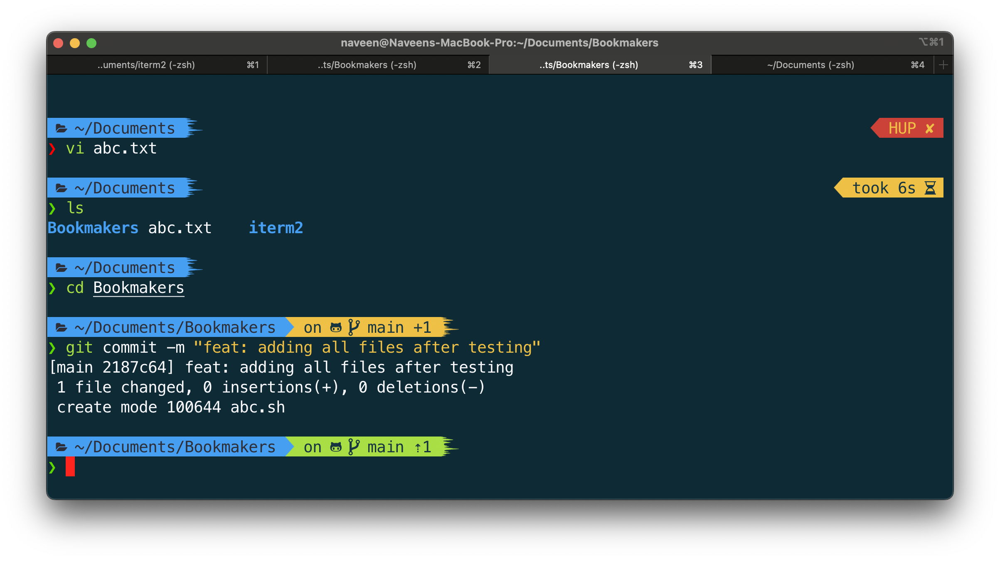
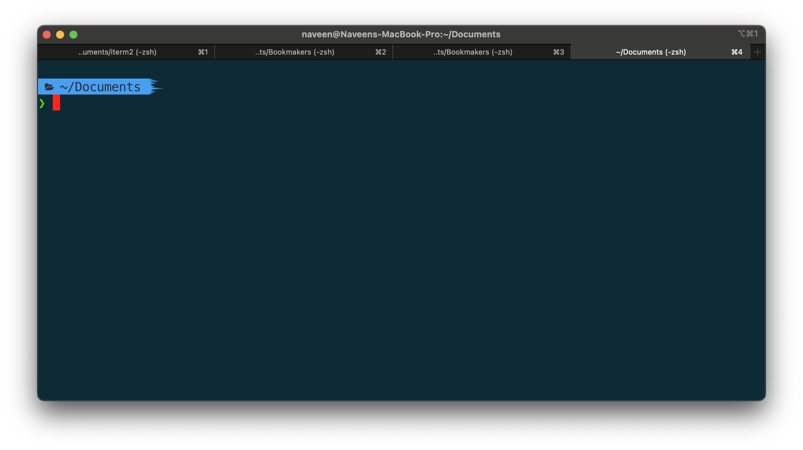

## Screenshots

## Setup
- Download and install iterm2 from official website
- Follow steps [here](https://www.josean.com/posts/terminal-setup) to install only ohmyzsh, p10k, zsh-autosuggestions, zsh-syntax-highlighting and Meslo Font (optional) 
- `cd` into this directory and  run `./setup.sh`. It:
  - Verifies your installations
  - Copies over Font files (if needed)
  - Copies over .zshrc and .p10.zsh files
- Import keymap `keymap.itermkeymap` file in iterm2 settings. It:
  - Adds these [5 super productive keyboard shortcuts](https://medium.com/macoclock/5-must-have-key-mappings-on-iterm2-to-be-more-productive-21c4daf56348)
  - Move the cursor by word (⌥ + ←)
  - Move the cursor to the beginning / the end of line (⌘ + ←)
  - Delete a word (⌥ + Delete)
  - Delete a line (⌘ + Delete)
  - Undo (⌘ + Z)

- Import color theme file `iterm-color-theme.itermcolors` in iterm2 settings
- Import Default Profile `Default.json` in iterm2 settings  

- Final Settings
  - go to `iterm ➔ Preferences ➔ Appearances ➔ Panes`
  - Set `Side Margins to 1`
  - Set `Top & Bottom Margins to 28` (Adjust accordingly)
- Set Font size based on what you prefer
  - `iterm ➔ Preferences ➔ Profiles ➔ text ➔ Font`

- In VS Code `⌘ + Shift + P`  ➔  User settings  ➔  `settings.json`. Set `"terminal.integrated.fontFamily": "MesloLGS NF"`
- Done. Enjoy!

 